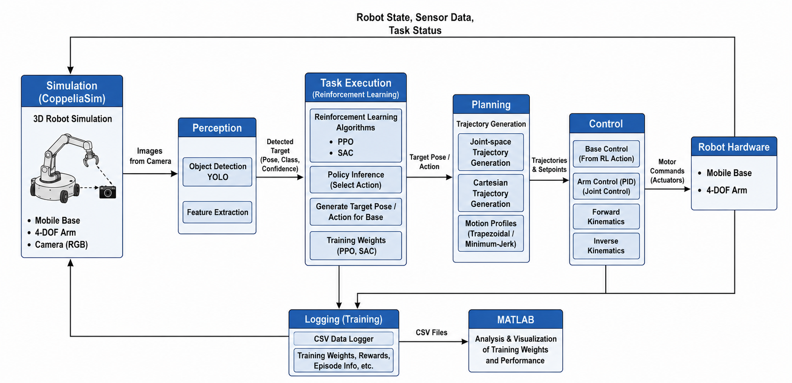
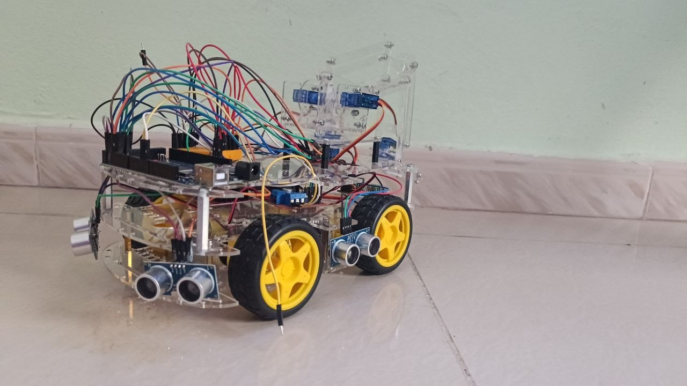
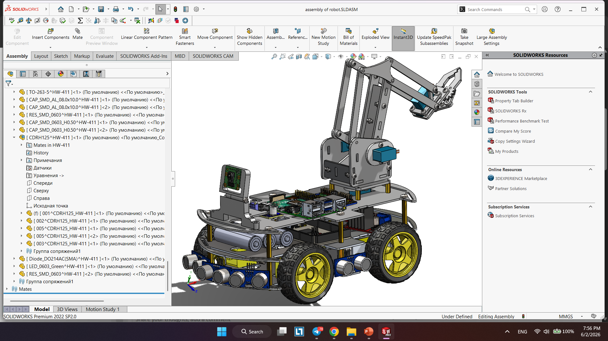
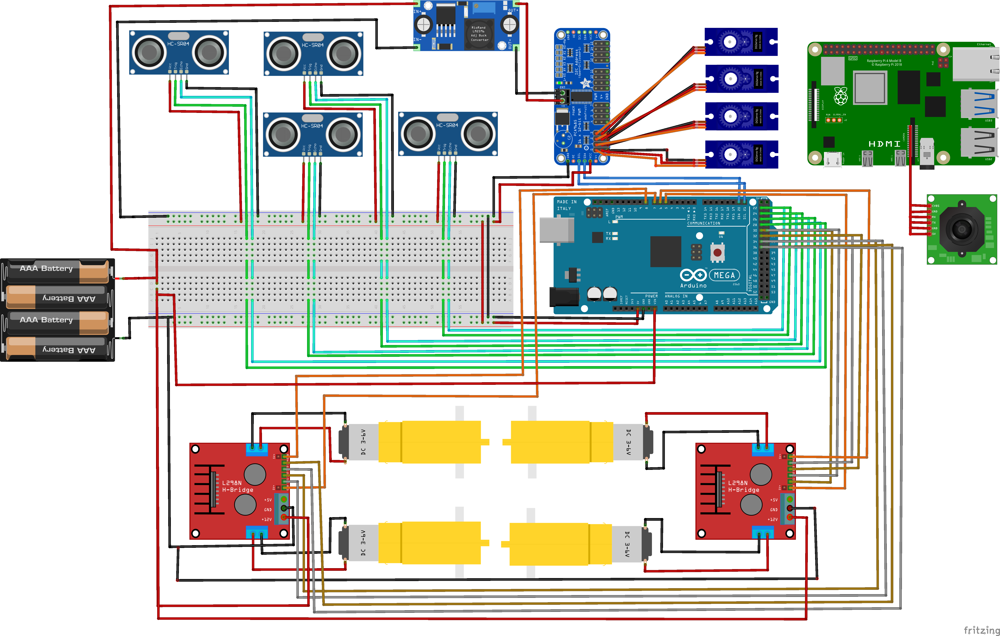
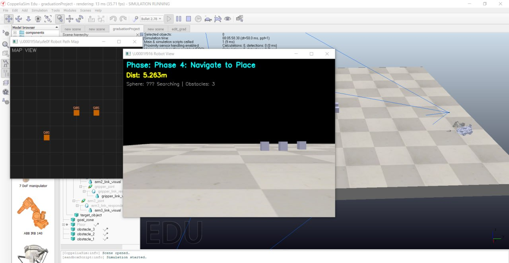
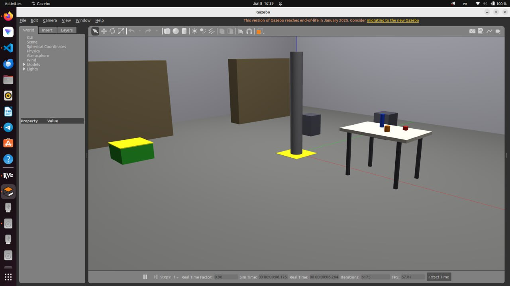

# Mobile Manipulator Simulation Academic Project Journey

This repository documents my complete academic development path in mobile manipulation, from coursework to graduation research and implementation.

The projects are ordered from newest to oldest:

1. Senior Project 2 (graduation project)
2. Senior Project
3. Semester Project

## Repository purpose

The repository is organized as a progressive engineering journey:

- semester-level foundation in modeling and control
- senior-level custom robot design and evaluation
- graduation-level system integration across software, simulation, and hardware tracks

Together, these projects demonstrate end-to-end competency in robotics software, kinematics and control, simulation validation, and prototyping.

## Senior Project 2 (Graduation Project)

Senior Project 2 is my university graduation project for the Bachelor's degree in Robotics and Intelligent Systems Engineering.

This project combines mechanical design, electronics, simulation, software architecture, and autonomous behaviors for a full mobile manipulator platform. It includes ROS 2 and Python simulation tracks, CAD resources, reinforcement learning experiments, and hardware-oriented assets.

### Project links

- [ROS 2 simulation workspace](./senior-project2/ros2_mobile_manipulator_ws/README.md)
- [Python simulation stack](./senior-project2/mobile_manipulator_sim_python/README.md)

### Technical scope

- mobile manipulator architecture and subsystem integration
- autonomous pick-and-place workflow design
- simulation in Gazebo, CoppeliaSim, and Python environments
- reinforcement learning exploration and evaluation assets
- hardware-oriented prototyping and electronics integration

### Senior Project 2 gallery

_Complete system architecture and integration view._

_Real-world prototype built and tested during the graduation project._

_Mechanical design representation of the robot body and manipulator._

_Electronics and wiring integration used in the full setup._

_CoppeliaSim environment used for simulation and validation._

_ROS-based Gazebo simulation world for autonomous task testing._

## Senior Project

The senior project focuses on a custom 3-DOF mobile manipulator design with MATLAB-based modeling and control. It represents the transition from structured course frameworks to an independently developed robotic platform.

- [Read Senior Project documentation](./senior-project/README.md)

## Semester Project

The semester project establishes the technical foundation using a KUKA youBot-style 5-DOF mobile manipulator with integrated MATLAB, ROS Noetic, and CoppeliaSim workflows.

- [Read Semester Project documentation](./semester-project/README.md)

## Repository structure

- `semester-project/` - Foundations in kinematics, control, and simulation.
- `senior-project/` - Custom mechanical design and control extension.
- `senior-project2/` - Graduation-level integrated robotics platform.

## Recommended reading order

1. Start with Senior Project 2 for the final integrated result.
2. Review Senior Project for custom mechanical and control evolution.
3. Review Semester Project for foundational methods and baseline architecture.

## Author

Zain Alabidin Shbani  
Bachelor's Degree in Robotics and Intelligent Systems Engineering
